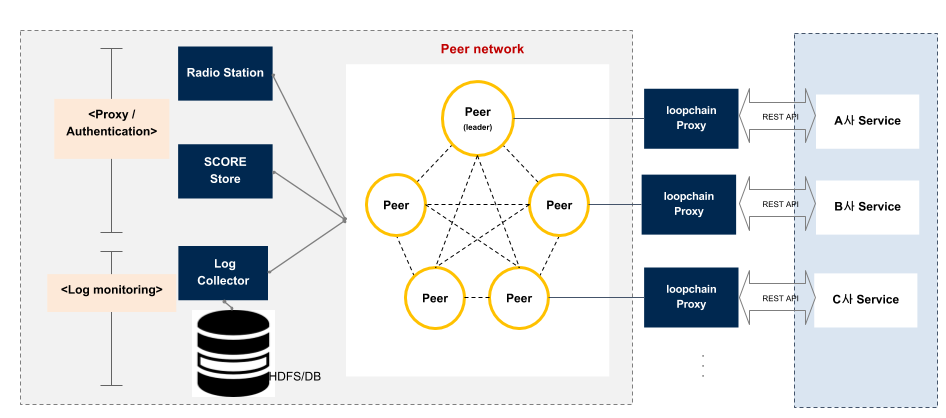

#  loopchain

## loopchain 이란?  
  loopchain은 효율적인 스마트컨트랙트를 기반으로 실시간 거래를 지원할 수 있는 고성능 블록체인입니다.


## Features


### Consensus
loopchain은 BFT(Byzantine Fault Tolerance)를 지원하는 LFT(Loop Fault Tolerance)를 통해 분기가 없는 빠른 합의를 지원를 지원합니다. 또한 LFT를 기반으로 신뢰 관계가 있는 복수의 노드를 하나의 그룹으로 묶어 좀더 빠른 합의를 이뤄낼 수 있으며 이러한 그룹 및 노드에게 투표권 수를 자유롭게 설정할 수 있어 다양한 합의 체계 구축이 가능합니다.

### SCORE(Smart Contract On Reliable Environment)
SCORE는 loopchain에서 지원하는 스마트컨트랙트를 지칭하는 것으로서 별도의 VM(Virtual Manchine)없이 노드 운영환경에서 직접적으로 실행되는 고성능 스마트컨트랙트 지원 기능입니다. SCORE는 쉽게 작성할 수 있어 높은 생산성을 가진 스마트컨트랙트이며 블록체인 프로세스와 별도의 프로세스로 동작하면서 다양한 업무를 개발할 수 있도록 지원합니다. 이에 대해서는 [SCORE 문서](score/REARME.md)를 참고 바랍니다.

### Multi Channel
Multi channel은 하나의 독립적인 블록체인 네트워크내에서 업무별로 채널이라는 가상의 네트워크를 구성하여 채널별로 거래 요청, 합의 및 스마트컨트랙트를 수행할 수 있는 기능입니다. 하나의 노드에 여러 업무별 해당 업무 당사자들과만 연결된 다양한 업무별 채널을 형성하기 때문에 채널별로 무결성 보장 및 합의가 이루어지며 거래 데이터가 실제 거래 당사자들만 보유하게 되어 다양한 규제에 대응할 수 있습니다.

### Tiered System
블록체인 네트워크에 참여시 인증과 함께 거래별로 PKI 기반 인증을 통해 거래 내역 검증 및 보안이 이루어집니다. 또한 거래에 참여하지 않지만 필요에따라 거래 내역을 감사할 수 있는 기능을 특정 노드에 부여하는 기능을 지원합니다.

그 외의 내용들은 [한국어 백서]()를 참고 바랍니다


## Components 들



### Peer
새로운 Tx(Transaction)을 만들어서 검증을 요청합니다 그리고 새로 검증된 block을 모아 Blockchain에 저장하고 그 내용을 읽어볼 수 있게 해줍니다

### Peer (Leader)
일정시간마다 네트워크의 트랜잭션을 모아 블록을 생성하고 다른 Peer들에게 검증을 요청하며, 다수의 Peer가 검증 후 해당 블록을 공인해서 보관하는 모듈입니다.

### Radio Station
Peer의 추가/탈퇴/재시작시, 다른 Peer들의 주소를 알림으로써 Peer끼리 통신을 이어가게 해주는 모듈입니다.

### loopchain proxy
각 Peer들에 접근을 용이하게 RESTful API를 노출해 주는 모듈입니다.

### log collector
각 Peer들이 돌아가는 Log를 수집하는 모듈입니다.

## 시작하기  (Getting stated)
Local machine 에서 실행하는 방법은 다음과 같습니다

### 사전 준비하기 (Prerequisites)

* Linux (CentOS, Ubuntu), macOS 10.12, Windows 10
* Python: 3.6 이상
* Virtualenv : 15.1.0 이상
* docker :17.x 이상

### 설치하기

 제일 먼저 clone으로 현재 프로젝트를 받으십시오. 그 다음 프로젝트 폴더로 가서 사용환경을 만들어야 합니다. 사용환경을 만들기 위해서는 아래와 같이 합니다

```
$ virtualenv -p python3 .  # 가상 작업환경 생성
$ source bin/activate    # 가상 작업환경 진입
$ pip3 install -r requirements.txt  # 필요한 package들을 가상환경에 설치
./generate_code.sh # gRPC가 통신에 필요한 code들을 생성
```

혹은 손쉽게 이렇게 해도 됩니다.

```
$ ./setup.sh
$ source bin/activate
$ ./generate_code.sh
```

## Unit 테스트 실행하기(Running the unit tests)

설치후, 전체적으로 동작이 되는지를 확인하기 위한 전체 Unit test는 아래와 같이 돌립니다.
```
$ ./run_test.sh
```

## Deployment
  실제 LoopChain을 돌리는 방법으로 두가지가 있습니다.

### 직접 올리기

 다음의 순서로 올리게 됩니다
#### 1. RadioStation 올리기

 ```
 $  ./radiostation.py  # RadioStation을 띄웁니다.
   ```

   그러면 이제 아래와 같은 Log를 보실 것입니다. 이 뜻은 현재 Local에서 9002번 Port로 다른 Peer가 접속해오기를 기다린다는 뜻입니다. 이렇게 RadioStation service를 올렸습니다.

```buildoutcfg
..........
'2017-07-20 15:57:09,315 DEBUG RestServerRS run... 9002'
'2017-07-20 15:57:09,373 INFO  * Running on http://0.0.0.0:9002/ (Press CTRL+C to quit)'
'2017-07-20 15:57:11,302 DEBUG Leader Peer Count: (0)'
'2017-07-20 15:57:11,303 ERROR There is no leader in this network.'
```

####  2. 여러개의 Peer 올리기


 새로운 Terminal을 띄워서 LoopChain folder로 갑니다. 이후 아래와 같이 입력합니다
  ```
 $ source bin/activate  # Python 가상 환경을 띄웁니다.  
 $ ./peer.py            # Peer를 띄웁니다.
   ```
 그러면 아래와 같은 Log를 보실 수 있습니다.
 ```buildoutcfg
 ...........
'2017-07-20 16:05:13,480 DEBUG peer list update: 1:192.168.18.153:7100 PeerStatus.connected c3c5f2f0-6d19-11e7-875d-14109fdb09f5 (<class 'str'>)'
'2017-07-20 16:05:13,480 DEBUG peer_id: c3c5f2f0-6d19-11e7-875d-14109fdb09f5'
'2017-07-20 16:05:13,480 DEBUG peer_self: <loopchain.baseservice.peer_list.Peer object at 0x106249b00>'
'2017-07-20 16:05:13,481 DEBUG peer_leader: <loopchain.baseservice.peer_list.Peer object at 0x106249b00>'
'2017-07-20 16:05:13,481 DEBUG Set Peer Type Block Generator!'
'2017-07-20 16:05:13,481 INFO LOAD SCORE AND CONNECT TO SCORE SERVICE!'
```
  같은 방식으로 또 다른 Peer를 띄워보실 수 있습니다. 그러나 이번에는 다른 Port를 이용해서 RadioStation과 연결을 해야 합니다

```
$ source bin/activate
$ ./peer.py -p 7101
```
 Peer는 RadioStation과 접속할 때, 한 Peer당 7100번 부터 새로운 포트를 받아서 접속합니다. RadioStation은 새로운 Peer가 접속될 때 마다, 기존에 있던 Peer들의 목록을 새로운 Peer에게 전달하고 새로운 Peer가 추가 된 것을 기존 Peer들에게 알려줍니다.  


#### 3. 각 Peer 상태 확인하기
  각 Peer들과 RadioStation의 상태를 읽어올 수 있게, 각 Peer들에게는 RESTful API로 연결할 수 있습니다.

```
$ curl http://localhost:9002/api/v1/peer/list  # 현재 Radiostation에 blockchain network를 구성하고 있는 peer들의 목록을 보여줍니다.
$ curl http://localhost:9000/api/v1/status/peer # 현재 Peer0 의 상태를 보여줍니다.
$ curl http://localhost:9100/api/v1/status/peer # 현재 Peer1 의 상태를 보여줍니다.
```
  자세한 RESTful API에 대해서는 [Peer RESTful API](proxy_rest_api.md), [Radiostation RESTful API](radiostation_proxy_restful_api.md)문서를 참고 바랍니다.


#### 3. 새로운 Transaction을 만듭니다.
 새로운 Transaction을 Peer0에 보내기 위해서는 다음과 같이 RESTful API를 호출합니다 
 
```
$ curl -H "Content-Type: application/json" -d '{"data":"hello"}' http://localhost:9000/api/v1/transactions

{"response_code": "0", "tx_hash": "9dc7e5ed17cc5f3258f9b11614b33295e87d80d49b101b7571f444524accee5f", "more_info": ""}
```


#### 4. 만들어진 Transaction의 height를 확인합니다.

```
$ curl http://localhost:9000/api/v1/blocks

{
 "response_code": 0, 
 "block_hash": "f7956cb168ac80e5fd569c53c95b55a92254f7a1c372ad06e936cc35357a8ead", 
 "block_data_json": 
   {
        "prev_block_hash": "af5570f5a1810b7af78caf4bc70a660f0df51e42baf91d4de5b2328de0e83dfc",
        "merkle_tree_root_hash": "1726e6d64a17cb1e0d664f4239f20b7176fc046ae6aa423922fb0ef6eb48512b", 
        "time_stamp": "1501132106740684",
        "height": "1",    # Height가 증가.
        "peer_id": "15e6d814-7289-11e7-bb81-14109fdb09f5"
   }
}
```

### Tutorial
  SCORE를 포함한 자세한 내용을 담은 [Tutorial](Tutorial.md)입니다.


## License
 이 프로젝트는 Apache 2.0 License를 따릅니다. 자세한 것은 [LICENSE](https://www.apache.org/licenses/LICENSE-2.0)를 참고 바랍니다.

## Acknowledgments
 이 프로젝트는 NIPA 유망 공개SW 기술개발 지원사업지원으로 진행되고 있습니다.
